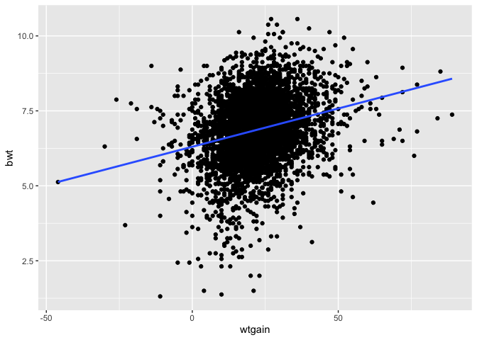
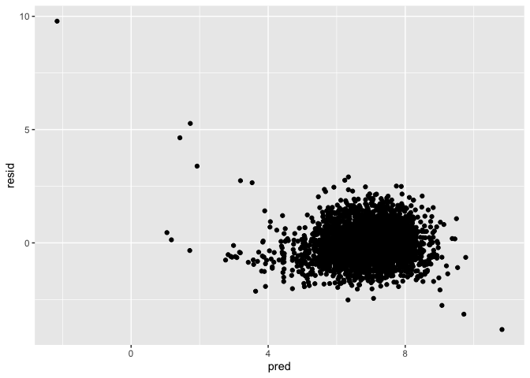
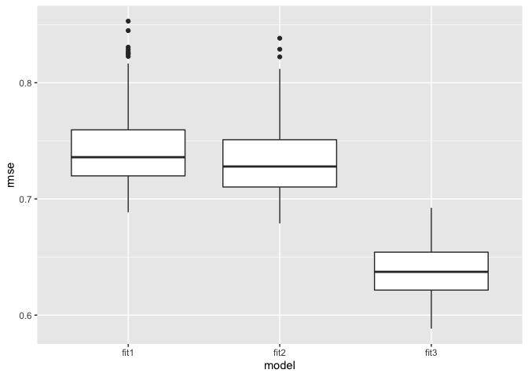
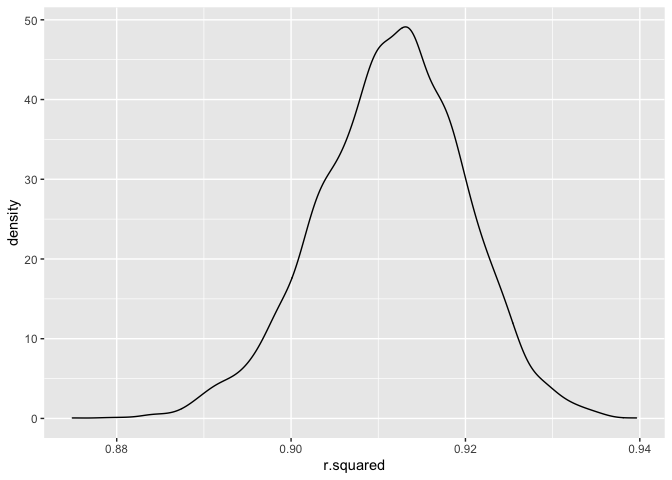
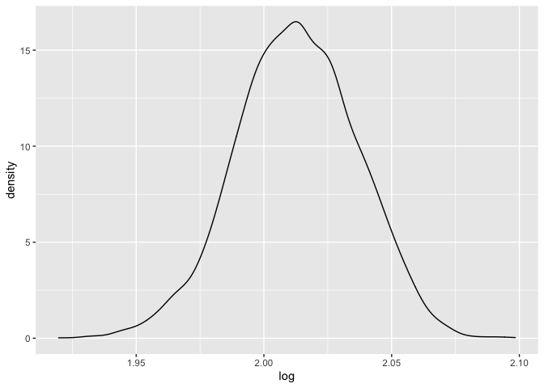

hw6
================
Kaitlyn Wang
12/2/2021

``` r
library(tidyverse)
library(modelr)
```

## Problem 1

``` r
birthweight_df = 
  read_csv("./birthweight.csv") %>% 
  mutate(bwt = bwt * 0.00220462)
```

``` r
birthweight_df %>% 
  ggplot(aes(x = wtgain, y = bwt)) +
  geom_point() +
  geom_smooth(method = lm, se = FALSE)
```

    ## `geom_smooth()` using formula 'y ~ x'

<!-- -->

``` r
birthweight_df %>% 
  ggplot(aes(x = blength, y = bwt)) +
  geom_point()
```

<!-- -->

``` r
fit1 = lm(bwt ~ wtgain + blength, data = birthweight_df)

fit1 %>% broom::tidy()
```

    ## # A tibble: 3 × 5
    ##   term        estimate std.error statistic   p.value
    ##   <chr>          <dbl>     <dbl>     <dbl>     <dbl>
    ## 1 (Intercept)  -8.29     0.208       -39.9 9.36e-297
    ## 2 wtgain        0.0113   0.00105      10.7 2.60e- 26
    ## 3 blength       0.300    0.00423      70.8 0

``` r
birthweight_df %>% 
  add_predictions(fit1) %>% 
  add_residuals(fit1) %>% 
  ggplot(aes(x = pred, y = resid)) +
  geom_point()
```

<!-- -->

I first made scatterplots to see whether there’s pattern of mother’s
weight gain to birth weight and birth length to birth weight. Although
there’s no obvious trend on mother’s weight gain to birth weight, there
shows an increase trend in birth weight with a higher birth length.
Therefore, I made a regression model on the main effects of mother’s
weight gain and baby’s birth length as predictors. A plot of model
residuals against fitted values is shown above.

``` r
fit2 = lm(bwt ~ blength + gaweeks, data = birthweight_df)
fit2 %>% broom::tidy()
```

    ## # A tibble: 3 × 5
    ##   term        estimate std.error statistic  p.value
    ##   <chr>          <dbl>     <dbl>     <dbl>    <dbl>
    ## 1 (Intercept)  -9.58     0.216       -44.4 0       
    ## 2 blength       0.283    0.00439      64.6 0       
    ## 3 gaweeks       0.0596   0.00379      15.7 2.36e-54

``` r
fit3 = lm(bwt ~ bhead * blength * babysex, data = birthweight_df)
fit3 %>% broom::tidy()
```

    ## # A tibble: 8 × 5
    ##   term                   estimate std.error statistic     p.value
    ##   <chr>                     <dbl>     <dbl>     <dbl>       <dbl>
    ## 1 (Intercept)           -29.9       6.08        -4.91 0.000000939
    ## 2 bhead                   0.838     0.184        4.56 0.00000528 
    ## 3 blength                 0.498     0.127        3.94 0.0000843  
    ## 4 babysex                14.1       3.70         3.80 0.000147   
    ## 5 bhead:blength          -0.00977   0.00378     -2.58 0.00981    
    ## 6 bhead:babysex          -0.437     0.113       -3.88 0.000105   
    ## 7 blength:babysex        -0.273     0.0774      -3.52 0.000429   
    ## 8 bhead:blength:babysex   0.00855   0.00233      3.67 0.000245

``` r
cv_df = 
  crossv_mc(birthweight_df, 80) %>% 
  mutate(
    train = map(train, as_tibble),
    test = map(test, as_tibble)
  )

cv_df = 
  cv_df %>% 
    mutate(
      fit1 = map(.x = train, ~lm(bwt ~ wtgain + blength, data = .x)),
      fit2 = map(.x = train, ~lm(bwt ~ blength + gaweeks, data = .x)),
      fit3 = map(.x = train, ~lm(bwt ~ bhead * blength * babysex, data = .x))
    ) %>% 
    mutate(
      rmse_fit1 = map2_dbl(.x = fit1, .y = test, ~rmse(model = .x, data = .y)),
      rmse_fit2 = map2_dbl(.x = fit2, .y = test, ~rmse(model = .x, data = .y)),
      rmse_fit3 = map2_dbl(.x = fit3, .y = test, ~rmse(model = .x, data = .y))
    )
  
cv_df %>% 
  select(.id, starts_with("rmse")) %>% 
  pivot_longer(
    rmse_fit1:rmse_fit3,
    names_to = "model",
    values_to = "rmse",
    names_prefix = "rmse_"
  ) %>% 
  ggplot(aes(x = model, y = rmse)) +
  geom_boxplot()
```

<!-- -->

## Problem 2

``` r
weather_df = 
  rnoaa::meteo_pull_monitors(
    c("USW00094728"),
    var = c("PRCP", "TMIN", "TMAX"), 
    date_min = "2017-01-01",
    date_max = "2017-12-31") %>%
  mutate(
    name = recode(id, USW00094728 = "CentralPark_NY"),
    tmin = tmin / 10,
    tmax = tmax / 10) %>%
  select(name, id, everything())
```

``` r
weather_bs = 
  weather_df %>% 
  select(tmax, tmin) %>% 
  bootstrap(5000) %>% 
  mutate(
    models = map(strap, ~ lm(tmax ~ tmin, data = .x)),
    results_rsqr = map(models, broom::glance),
    results_beta = map(models, broom::tidy))
```

``` r
rsqr = 
  weather_bs %>% 
    select(results_rsqr, .id) %>% 
    unnest(results_rsqr) 

ggplot(rsqr, aes(r.squared)) + 
    geom_density()
```

<!-- -->

``` r
quantile(rsqr$r.squared, c(.025, 0.975))
```

    ##      2.5%     97.5% 
    ## 0.8936766 0.9271529

The plot shows that the distribution of estimate r square is left-skewed
and the confidence interval is (0.89, 0.93).

``` r
beta0 = 
  weather_bs %>% 
  select(results_beta, .id) %>% 
  unnest(results_beta) %>% 
  filter(term == "(Intercept)") %>% 
  select(estimate, .id) %>% 
  rename(beta0 = estimate)
  

beta1 = 
  weather_bs %>% 
  select(results_beta, .id) %>% 
  unnest(results_beta) %>% 
  filter(term == "tmin") %>% 
  select(estimate, .id) %>% 
  rename(beta1 = estimate)

log = 
  inner_join(beta0, beta1, by = ".id") %>% 
  relocate(.id) %>% 
  mutate(
    log = log(beta0 * beta1)
  )

ggplot(log, aes(log)) + 
  geom_density()
```

<!-- -->

``` r
quantile(log$log, c(.025, 0.975))
```

    ##     2.5%    97.5% 
    ## 1.964835 2.057787

The plot shows that the distribution is left-skewed and the confidence
interval is (1.97, 2.06).
